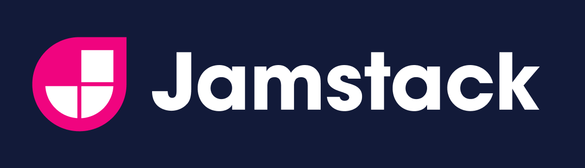
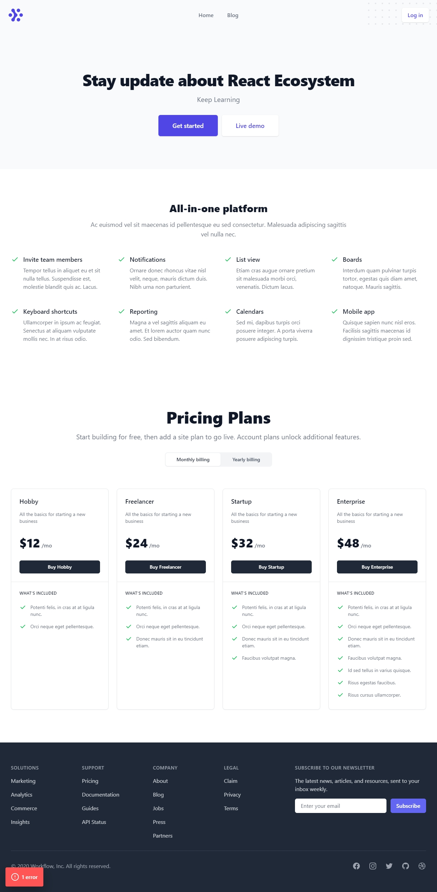
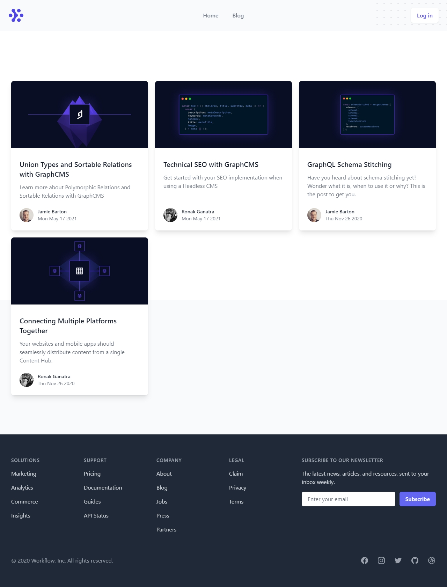
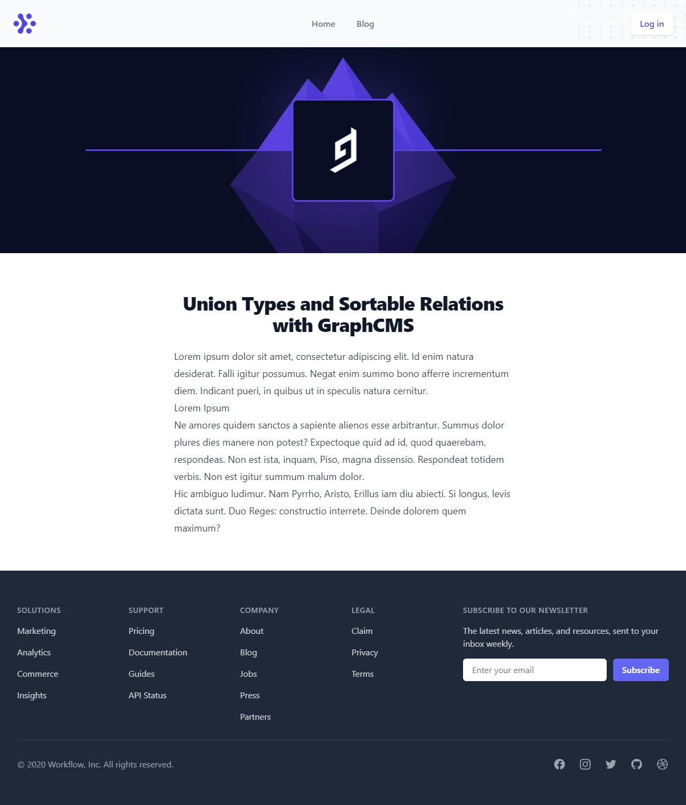

<h1 align="center">
  
</h1>

 

## Overview 📖
Sample architecture applying JAMstack concepts to build blog website with NEXT.JS and GraphCMS.

 

## Showcase 📸

  

   
  

 

## Technologies 👨‍💻

This project has been created with the following technologies:

- [React](https://reactjs.org)
- [Next.JS](https://nextjs.org/)
- [Graphcms](https://app.graphcms.com/)
- [Tailwindcss](https://tailwindcss.com)
- [Vite](https://vitejs.dev)
- [TypeScript](https://www.typescriptlang.org)
- [JAMstack](https://jamstack.org/)
- [Codegen](https://www.graphql-code-generator.com/)

Made with  💜 by Jady Rufino
